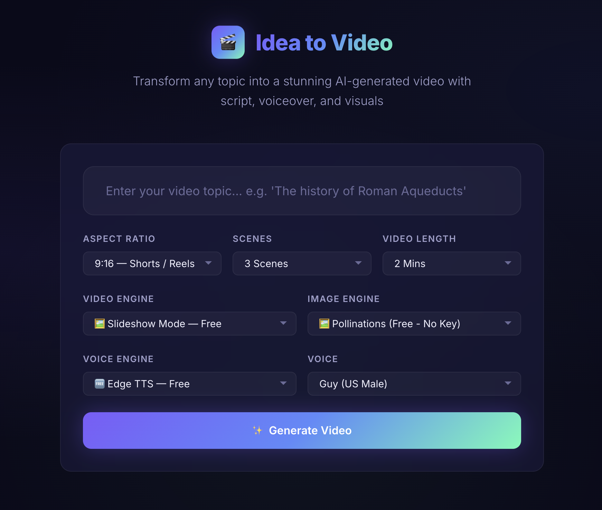
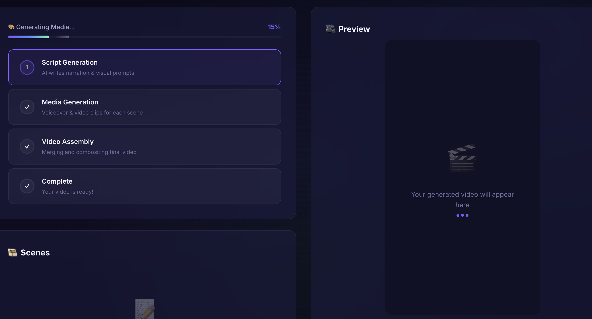

<h1 align="center">🎬 Ideo: AI Idea-to-Video Generator</h1>

<p align="center">
  <em>An end-to-end AI video orchestrator that turns simple text prompts into fully assembled, ready-to-publish videos.</em>
</p>

<p align="center">
  
  
  
  
  
</p>

---

## 🎥 Showcase Demo

Here is a sample video completely generated by **Ideo** from a single text prompt:

<p align="center">
  <video src="docs/demo_english.mp4" controls width="40%"></video>
  <video src="docs/demo_hindi.mp4" controls width="40%"></video>
</p>

---

## 🖥️ User Interface

*(Replace these placeholders with your actual UI screenshots by placing the image files in the `docs` folder!)*

<p align="center">
  
  &nbsp;
  
</p>

---

## ✨ Features & Capabilities

Ideo is designed to be highly modular and configurable. It offers a range of options out-of-the-box:

### ⚙️ Engine Options
- **Script Generation:** Powered by **Google Gemini 2.5 Flash** for highly structured JSON scene planning, visual prompts, and narration scripting.
- **Text-to-Speech (TTS):** 
  - **Edge TTS:** Completely *free* and fast (default option).
  - **ElevenLabs v3:** Premium, ultra-realistic AI voice generation for professional narration.
- **Visual AI:** Uses **Fal.ai Hunyuan Video** for generating cinematic, high-quality video clips, and **Fal.ai FLUX** for catching, hyper-realistic thumbnails.
- **Smart Assembly:** Uses **FFmpeg** to merge audio tracks with video clips, pad timings, and seamlessly concatenate the final video.

### 📐 Video Formats
Generate videos perfectly sized for your target platform:
- `9:16` - Perfect for TikTok, YouTube Shorts, and Instagram Reels.
- `16:9` - Standard format for traditional YouTube videos.
- `1:1` - Square format for standard Instagram or Facebook posts.

### 🧪 Mock Mode (Developer Friendly)
No API credits? No problem. Set `MOCK_MODE=true` in your `.env` to build and test the UI without hitting paid APIs. Mock mode instantly generates:
- Silent `.mp3` audio files
- Solid color `.mp4` video clips with overlaid text identifying the scene
- A placeholder thumbnail

### ⚡ Real-Time Streaming
The pipeline utilizes Server-Sent Events (SSE) to stream live progress updates to the frontend, so you always know exactly which scene is currently rendering or being assembled.

---

## 🛠️ Tech Stack

| Component | Technology | Description |
|:---|:---|:---|
| **Backend** | `FastAPI` (Python) | High-performance, async API router |
| **Script AI** | `Google Gemini 2.5 Flash` | LLM for storyboarding |
| **Voice AI** | `ElevenLabs` / `Edge TTS` | Narration |
| **Video & Image**| `Fal.ai` (Hunyuan / FLUX) | Visuals |
| **Assembly** | `FFmpeg` | Video processing & concatenation |
| **Frontend** | `Vanilla HTML/CSS/JS` | Lightweight, reactive UI |

---

## 🚀 Quick Start

### 1. Prerequisites
- **Python 3.11+**
- **FFmpeg**: Required for media assembly.
  - macOS: `brew install ffmpeg`
  - Ubuntu/Debian: `sudo apt install ffmpeg`
- **API Keys**: Get your keys for [Gemini](https://aistudio.google.com/), [Fal.ai](https://fal.ai/), and optionally [ElevenLabs](https://elevenlabs.io/).

### 2. Install

```bash
git clone https://github.com/yourusername/Ideo.git
cd Ideo

# Create and activate virtual environment
python -m venv .venv
source .venv/bin/activate  # On Windows use: .venv\Scripts\activate

# Install dependencies
pip install -r requirements.txt
```

### 3. Configure

Copy the environment template and fill in your keys:

```bash
cp .env.example .env
```

Open `.env` and configure your desired options (e.g., set `TTS_ENGINE=edge` for free voice generation).

### 4. Run the App

Start the FastAPI backend and serve the frontend:

```bash
# Production mode (calls real APIs)
uvicorn app.main:app --reload --port 8000

# Mock mode (free testing, no APIs called)
MOCK_MODE=true uvicorn app.main:app --reload --port 8000
```

Open **[http://localhost:8000](http://localhost:8000)** in your browser!

---

## 📡 API Endpoints

Ideo exposes a clean REST API for generating and managing videos programmatically.

| Method | Endpoint | Description |
|:---|:---|:---|
| `POST` | `/api/projects` | Initialize a new video generation task |
| `GET` | `/api/projects` | List all historical projects |
| `GET` | `/api/projects/{id}` | Get project metadata and status |
| `GET` | `/api/projects/{id}/stream`| Connect to live SSE progress stream |
| `GET` | `/api/projects/{id}/download`| Download the final assembled `.mp4` |

---

## 📄 License
This project is licensed under the **MIT License**.
